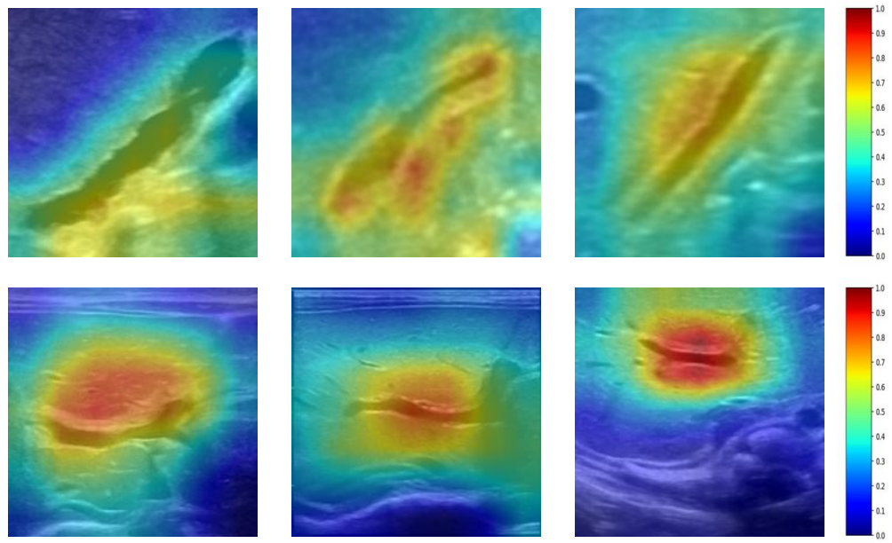
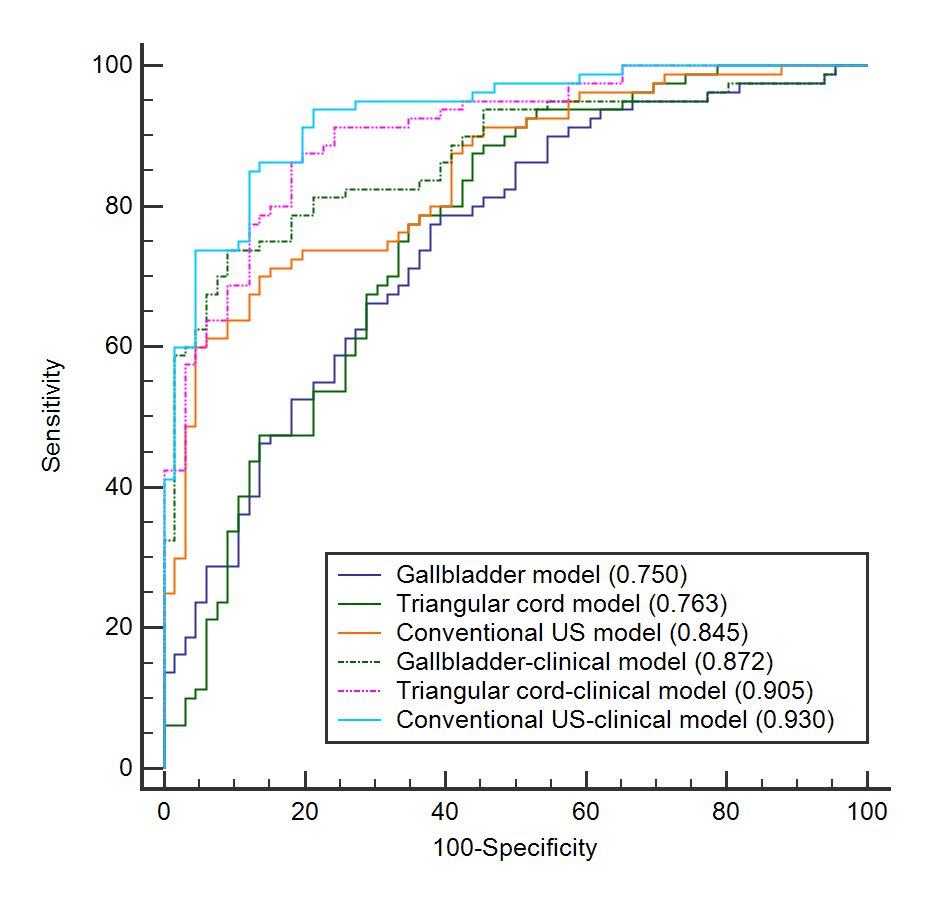

# Multimodal Biliary Atresia Diagnose System

## Content
- [Overview](#overview)
- [Requirements](#requirements)
- [Demo](#demo)
- [Visualization](#visualization)
- [Result](#result)

## Overview
Biliary atresia (BA) is a complex hepatobiliary disease in infants, which is still challenging to diagnose in current clinical practice. We aim to develop and validate a multimodal model by integrating conventional ultrasound, shear wave elastography, and clinical information to help diagnose BA.

## Requirements
The following python pakage are required :
```bash
pip install \
  torch \
  torchvision \
  numpy \
  scikit-learn \
  tensorboardX \
  Pillow \
  tqdm \
  SimpleITK \
  pandas \
  pretrainedmodels \
  matplotlib
```

## Demo
You can enter python run.sh in the terminal to run the code.

## Visualization


## Result
The model yields  an area under receiver operating characteristic curve (AUC) of 0.941 (95% confidence interval: 0.891-0.972) on the multi-center external validation dataset. Moreover, the diagnosis based on sonographic video sequences by the model yielded AUC 0.930 (95% confidence interval: 0.876-0.966).
<div style="display: flex; justify-content: space-between; margin: 20px 0;"> <div style="flex: 1; padding: 10px; text-align: center;">  <p style="font-style: italic; margin-top: 8px;">图1: 多中心外部验证结果</p> </div> <div style="flex: 1; padding: 10px; text-align: center;">  <p style="font-style: italic; margin-top: 8px;">图2: 超声视频序列诊断结果</p> </div> </div>
