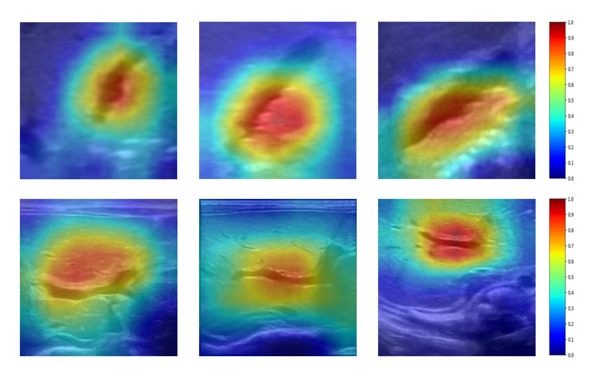

# Multimodal Biliary Atresia Diagnosis

## Content
- [Overview](#overview)
- [Requirements](#requirements)
- [Demo](#demo)
- [Visualization](#visualization)
- [Result](#result)

## Overview
Biliary atresia (BA) is a complex hepatobiliary disease in infants, which is still challenging to diagnose in current clinical practice. We aim to develop and validate a multimodal model by integrating conventional ultrasound, shear wave elastography, and clinical information to help diagnose BA.

## Requirements
The following python pakage are required :
```bash
pip install \
  torch \
  torchvision \
  numpy \
  scikit-learn \
  tensorboardX \
  Pillow \
  tqdm \
  SimpleITK \
  pandas \
  pretrainedmodels \
  matplotlib
```

## Demo
You can enter python run.sh in the terminal to run the code.

## Visualization
<center class="half">
  
</center>


## Result
The model yields  an area under receiver operating characteristic curve (AUC) of 0.941 (95% confidence interval: 0.891-0.972) on the multi-center external validation dataset. Moreover, the diagnosis based on sonographic video sequences by the model yielded AUC 0.930 (95% confidence interval: 0.876-0.966).

```
@article{zhou2025multimodal,
  title={Multimodal model for the diagnosis of biliary atresia based on sonographic images and clinical parameters},
  author={Zhou, Wenying and Lin, Run and Zheng, Yuanhang and Wang, Shan and Xu, Bin and Tang, Zijian and Wang, Ruixuan and Yu, Cheng and Yan, Hualin and Liu, Juxian, etc.},
  journal={npj Digital Medicine},
  volume={8},
  number={1},
  pages={1--11},
  year={2025},
  publisher={Nature Publishing Group}
}
```
